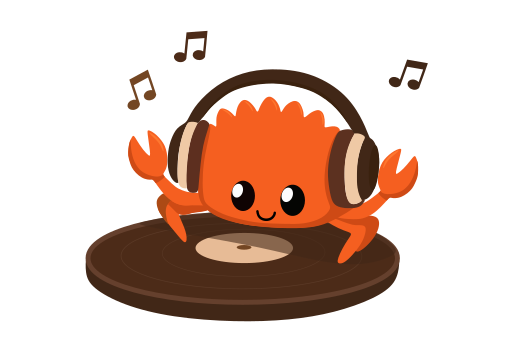

# RustMusicPlayer

> Self written local music player using **Rust**. 
> This project also aimed for practicing git working process.
> Don't judge me hard, **It' my first project on Rust and Git.**

## Libs
- **Rodio**
- **Iced**

**Thank you for visiting**
